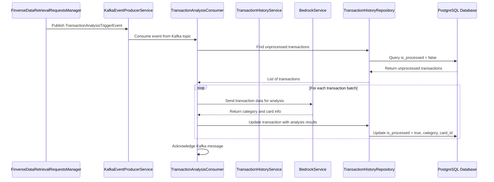

# Design Document

## Overview

The Transaction Analysis Automation feature implements an event-driven system that automatically processes transaction data using Amazon Bedrock AI services. The system integrates with the existing Finverse data retrieval pipeline to trigger analysis when new transaction data becomes available, enriching transactions with categorization and card information extraction.

The design follows the existing Spring Boot architecture patterns, utilizing Kafka for event-driven communication, R2DBC for reactive database operations, and integrating with AWS Bedrock for AI-powered transaction analysis.

## Architecture

### High-Level Flow



### Component Integration

The feature integrates with existing components:

- **FinverseDataRetrievalRequestsManager**: Modified to publish trigger events
- **KafkaEventProducerService**: Extended to support new event type
- **TransactionHistoryRepository**: Extended with unprocessed transaction queries
- **TransactionHistoryProcessingServiceBedrockImpl**: Enhanced with actual Bedrock integration

## Components and Interfaces

### 1. Event Model

**TransactionAnalysisTriggerEvent**
```kotlin
data class TransactionAnalysisTriggerEvent(
    val eventId: String = UUID.randomUUID().toString(),
    val timestamp: Instant = Instant.now(),
    val userId: Int,
    val institutionId: String,
    val loginIdentityId: String,
    val totalTransactionsRetrieved: Int = 0
)
```

### 2. Kafka Configuration Extensions

**New Topic Configuration**
- Topic: `transaction-analysis-trigger`
- Consumer Factory: `transactionAnalysisConsumerFactory`
- Listener Container Factory: `transactionAnalysisKafkaListenerContainerFactory`

### 3. Transaction Analysis Consumer

**TransactionAnalysisConsumer**
```kotlin
@Service
class TransactionAnalysisConsumer(
    private val transactionHistoryRepository: TransactionHistoryRepository,
    private val transactionHistoryProcessingService: TransactionHistoryProcessingService
) {
    @KafkaListener(
        topics = ["\${flow.kafka.topics.transaction-analysis-trigger}"],
        groupId = "\${spring.kafka.consumer.group-id}",
        containerFactory = "transactionAnalysisKafkaListenerContainerFactory"
    )
    suspend fun handleTransactionAnalysisTrigger(
        event: TransactionAnalysisTriggerEvent, 
        acknowledgment: Acknowledgment
    )
}
```

### 4. Enhanced Transaction History Repository

**New Repository Methods**
```kotlin
interface TransactionHistoryRepository {
    // Existing methods...
    
    suspend fun findUnprocessedTransactions(): List<TransactionHistory>
    suspend fun findUnprocessedTransactionsByUserId(userId: Int): List<TransactionHistory>
    suspend fun updateTransactionAnalysis(
        id: Long, 
        category: String?, 
        friendlyDescription: String?,
        extractedCardNumber: String?,
        revisedTransactionDate: LocalDate?,
        isProcessed: Boolean
    ): Boolean
    suspend fun batchUpdateTransactionAnalysis(
        updates: List<TransactionAnalysisUpdate>
    ): Int
}

data class TransactionAnalysisUpdate(
    val transactionId: Long,
    val category: String?,
    val friendlyDescription: String?,
    val extractedCardNumber: String?,
    val revisedTransactionDate: LocalDate?,
    val isProcessed: Boolean = true
)
```

### 5. Bedrock Integration Service

**BedrockTransactionAnalysisService**
```kotlin
@Service
class BedrockTransactionAnalysisService(
    private val bedrockClient: BedrockRuntimeClient,
    @Value("\${aws.bedrock.model-id}") private val modelId: String
) {
    suspend fun analyzeTransaction(transaction: TransactionHistory): TransactionAnalysisResult
    suspend fun analyzeTransactionBatch(transactions: List<TransactionHistory>): List<TransactionAnalysisResult>
}

data class TransactionAnalysisResult(
    val transactionId: Long,
    val revisedTransactionDate: LocalDate?,
    val category: String?,
    val cardNumber: String?,
    val friendlyDescription: String?,
    val confidence: Double,
    val success: Boolean,
    val errorMessage: String? = null
)
```

### 6. Enhanced Transaction Processing Service

**Updated TransactionHistoryProcessingServiceBedrockImpl**
```kotlin
@Service
class TransactionHistoryProcessingServiceBedrockImpl(
    private val transactionHistoryRepository: TransactionHistoryRepository,
    private val bedrockTransactionAnalysisService: BedrockTransactionAnalysisService,
    private val cardRepository: CardRepository
) : TransactionHistoryProcessingService {
    
    override suspend fun processTransaction(transactionHistoryReference: String)
    suspend fun processUnprocessedTransactions(userId: Int? = null): ProcessingResult
    suspend fun processTransactionBatch(transactions: List<TransactionHistory>): BatchProcessingResult
}
```

## Data Models

### Database Schema Updates

The existing `transaction_histories` table needs additional columns for the new analysis results:

**Required Schema Changes:**
```sql
ALTER TABLE transaction_histories 
ADD COLUMN IF NOT EXISTS transaction_category VARCHAR(255) DEFAULT NULL,
ADD COLUMN IF NOT EXISTS extracted_card_number VARCHAR(255) DEFAULT NULL,
ADD COLUMN IF NOT EXISTS revised_transaction_date DATE DEFAULT NULL;
```

**Updated Entity Fields:**
- `is_processed BOOLEAN DEFAULT false` - Processing status flag (existing)
- `transaction_category VARCHAR(255)` - Category from Bedrock analysis (new)
- `friendly_description VARCHAR(255)` - Store name extracted by Bedrock (existing, will be updated)
- `extracted_card_number VARCHAR(255)` - Card number extracted from description (new)
- `revised_transaction_date DATE` - Corrected transaction date if found (new)

### Bedrock Request/Response Models

**BedrockAnalysisRequest**
```kotlin
data class BedrockAnalysisRequest(
    val transactions: List<TransactionForAnalysis>
)

data class TransactionForAnalysis(
    val id: Long,
    val description: String
)
```

**BedrockAnalysisResponse**
```kotlin
data class BedrockAnalysisResponse(
    val results: List<TransactionAnalysisResult>
)
```

## Error Handling

### Error Handling Strategy

1. **Kafka Consumer Level**
   - Use manual acknowledgment to control message processing
   - Implement retry logic with exponential backoff
   - Dead letter queue for permanently failed messages

2. **Bedrock API Level**
   - Retry failed API calls with exponential backoff
   - Handle rate limiting and throttling
   - Graceful degradation for service unavailability

3. **Database Level**
   - Transaction rollback for batch processing failures
   - Optimistic locking for concurrent updates
   - Connection pool management

### Error Recovery Patterns

```kotlin
class TransactionAnalysisErrorHandler {
    suspend fun handleBedrockError(error: Exception, transaction: TransactionHistory): TransactionAnalysisResult
    suspend fun handleDatabaseError(error: Exception, updates: List<TransactionAnalysisUpdate>): Boolean
    suspend fun handleKafkaError(error: Exception, event: TransactionAnalysisTriggerEvent): Boolean
}
```

## Testing Strategy

### Unit Testing

1. **Service Layer Tests**
   - Mock Bedrock client responses
   - Test error handling scenarios
   - Validate business logic

2. **Repository Layer Tests**
   - Test SQL queries with H2 in-memory database
   - Validate data mapping and transformations
   - Test batch operations

3. **Consumer Tests**
   - Mock Kafka message consumption
   - Test acknowledgment handling
   - Validate error scenarios

### Integration Testing

1. **Kafka Integration**
   - Test end-to-end message flow
   - Validate consumer group behavior
   - Test retry mechanisms

2. **Database Integration**
   - Test with PostgreSQL test containers
   - Validate transaction boundaries
   - Test concurrent access scenarios

3. **AWS Integration**
   - Mock Bedrock service responses
   - Test authentication and authorization
   - Validate request/response serialization

### Performance Testing

1. **Batch Processing Performance**
   - Test with various batch sizes
   - Measure throughput and latency
   - Identify optimal batch configurations

2. **Concurrent Processing**
   - Test multiple consumer instances
   - Validate partition-based scaling
   - Test resource utilization

## Configuration Management

### Application Properties

```properties
# Transaction Analysis Configuration
flow.transaction-analysis.batch-size=50
flow.transaction-analysis.max-retries=3
flow.transaction-analysis.retry-delay-ms=1000
flow.transaction-analysis.enabled=true

# AWS Bedrock Configuration
aws.bedrock.region=us-east-1
aws.bedrock.model-id=anthropic.claude-3-sonnet-20240229-v1:0
aws.bedrock.max-tokens=1000
aws.bedrock.temperature=0.1
aws.bedrock.timeout-ms=30000

# Kafka Topics
flow.kafka.topics.transaction-analysis-trigger=transaction-analysis-trigger
```

### Configuration Classes

```kotlin
@ConfigurationProperties(prefix = "flow.transaction-analysis")
data class TransactionAnalysisProperties(
    val batchSize: Int = 50,
    val maxRetries: Int = 3,
    val retryDelayMs: Long = 1000,
    val enabled: Boolean = true
)

@ConfigurationProperties(prefix = "aws.bedrock")
data class BedrockProperties(
    val region: String = "us-east-1",
    val modelId: String,
    val maxTokens: Int = 1000,
    val temperature: Double = 0.1,
    val timeoutMs: Long = 30000
)
```

## Security Considerations

### AWS IAM Permissions

Required IAM permissions for Bedrock access:
```json
{
    "Version": "2012-10-17",
    "Statement": [
        {
            "Effect": "Allow",
            "Action": [
                "bedrock:InvokeModel",
                "bedrock:InvokeModelWithResponseStream"
            ],
            "Resource": "arn:aws:bedrock:*:*:foundation-model/*"
        }
    ]
}
```

### Data Privacy

1. **Transaction Data Handling**
   - Minimize data sent to Bedrock (exclude sensitive fields)
   - Implement data masking for PII
   - Ensure compliance with data retention policies

2. **Logging and Monitoring**
   - Avoid logging sensitive transaction details
   - Implement structured logging for audit trails
   - Monitor for unusual processing patterns

## Monitoring and Observability

### Metrics

1. **Processing Metrics**
   - Transactions processed per minute
   - Processing success/failure rates
   - Average processing time per transaction
   - Bedrock API response times

2. **Error Metrics**
   - Failed transaction analysis count
   - Bedrock API error rates
   - Database operation failures
   - Kafka consumer lag

### Logging

1. **Structured Logging**
   - Transaction processing lifecycle events
   - Bedrock API interactions
   - Error conditions with context
   - Performance metrics

2. **Log Levels**
   - INFO: Processing milestones
   - WARN: Recoverable errors
   - ERROR: Processing failures
   - DEBUG: Detailed processing steps

### Health Checks

```kotlin
@Component
class TransactionAnalysisHealthIndicator : HealthIndicator {
    override fun health(): Health {
        // Check Bedrock connectivity
        // Verify database access
        // Validate Kafka consumer status
    }
}
```